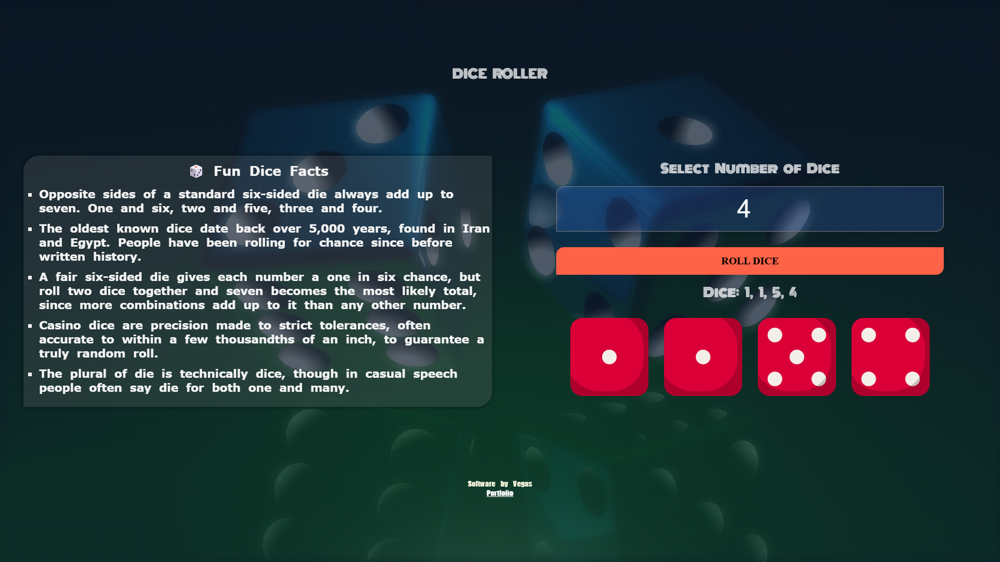

# Dice Roller — A Beginner-Friendly Practice Project

A simple dice roller built as part of **The Vegas Playground Projects** — a series of small, beginner-friendly builds for developers just starting out. Enter how many dice you want to roll, and see the results as both numbers and matching dice-face images.



## Who This Is For

- Beginners learning JavaScript fundamentals who want a small, real project to practice on
- Anyone wanting to practice DOM manipulation and working with arrays
- Developers who want a simple sandbox to experiment with new features without breaking anything complex

## Features

- Roll any number of dice at once
- Random values generated for each die (1 to 6)
- Matching dice-face images displayed for every roll
- Simple, responsive, and dependency-free — pure HTML, CSS, and JavaScript

## Tech Stack

- **HTML** — structure
- **CSS** — styling and layout
- **JavaScript** — random number generation and DOM interaction

No frameworks, no build tools, no dependencies — intentionally kept simple so anyone at any level can read and understand the whole project quickly.

## Getting Started

1. Clone the repository:
```bash
   git clone https://github.com/vegazzs/vegas-playground/tree/main/dice-roller
```
2. Open `dice-roller/dice.html` in your browser.

That's it — the dice roller runs entirely client-side, nothing to install or configure.

## Project Structure
```
dice-roller/
├── dice.html
├── dice.css
├── dice.js
├── assets/
| └──bgs/
│ └── diceImgs/
└── README.md
```


## How It Works

The core logic loops once for each die requested, generating a random number between 1 and 6 using `Math.floor(Math.random() * 6) + 1`, then builds up an array of results and matching image tags before displaying them all at once.

## Ideas to Practice With This Project

- [ ] Add a running total of all dice rolled
- [ ] Change animation pattern
- [ ] Support different dice types (d4, d10, d20, etc.)
- [ ] Track and display roll history

## Author

Built by **Vegas** — part of [The Vegas Playground Projects](https://github.com/vegazzs/vegas-playground/), a series of simple, beginner-friendly builds for developers just starting out.

## License

This project is open source and available under the [MIT License](LICENSE).