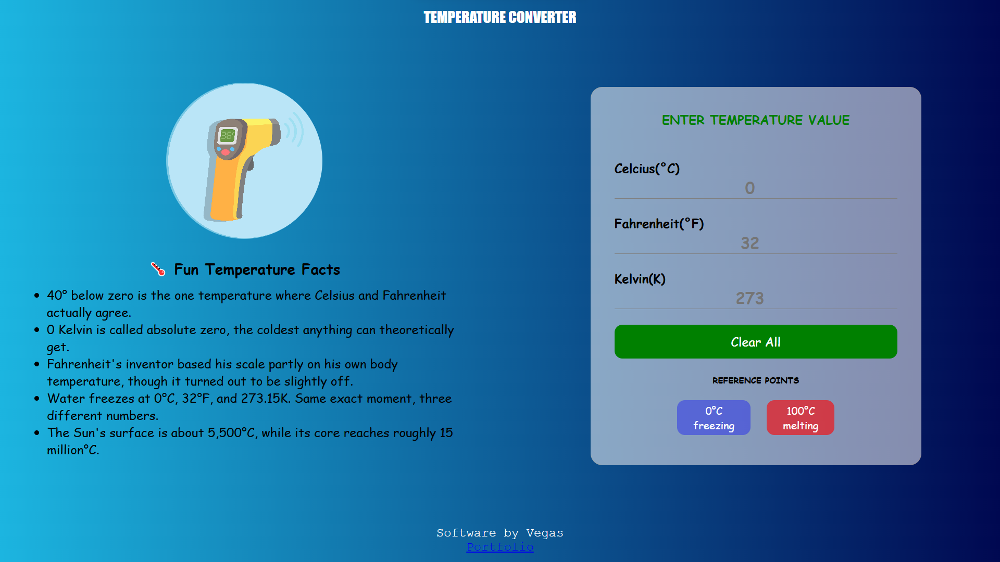

# Temperature Converter — A Beginner-Friendly Practice Project

A live temperature converter built as part of **The Vegas Playground Projects** — a series of small, beginner-friendly builds for developers just starting out. Type a value into any of the three fields (Celsius, Fahrenheit, or Kelvin) and watch the other two update instantly.



## Who This Is For

- Beginners learning JavaScript fundamentals who want a small, real project to practice on
- Anyone wanting to practice CSS Grid and responsive layouts
- Developers who want a simple sandbox to experiment with new features without breaking anything complex

## Features

- Live, two-way conversion between Celsius, Fahrenheit, and Kelvin — type in any field, the others update instantly
- Responsive grid layout: a full-width header, a fun-facts panel with an illustration, and the converter card
- Reference point chips for water's freezing (0°C) and boiling (100°C) points
- Clear All button to reset every field at once

## Tech Stack

- **HTML** — structure
- **CSS** — Grid layout, responsive design
- **JavaScript** — live conversion logic and DOM interaction

No frameworks, no build tools, no dependencies — intentionally kept simple so anyone at any level can read and understand the whole project quickly.

## Getting Started

1. Clone the repository:
   ```bash
   git clone https://github.com/vegazzs/vegas-playground
   ```
2. Open `temperature-converter/temperature.html` in your browser.

That's it — the converter runs entirely client-side, nothing to install or configure.

## Project Structure

```
temperature-converter/
├── temperature.html
├── temperature.css
├── temperature.js
└── README.md
```

## How It Works

Each input field has its own conversion function, since converting *from* Celsius uses a different formula than converting *from* Fahrenheit or Kelvin:

- **Celsius → Fahrenheit/Kelvin:** `(C × 9/5) + 32` and `C + 273.15`
- **Fahrenheit → Celsius/Kelvin:** `(F − 32) × 5/9`, then converted to Kelvin
- **Kelvin → Celsius/Fahrenheit:** `K − 273.15`, then converted to Fahrenheit

Each function is wired to its input's `input` event, so typing in any field immediately recalculates and fills in the other two.

## Ideas to Practice With This Project

- [ ] Add a unit toggle to switch which field is "primary"
- [ ] Add input validation (e.g. reject values below absolute zero)
- [ ] Add more reference points (body temperature, boiling point of nitrogen, etc.)
- [ ] Animate the value changes when a field updates

## Author

Built by **Vegas** — part of [The Vegas Playground Projects](https://github.com/vegazzs/vegas-playground), a series of simple, beginner-friendly builds for developers just starting out.

## License

This project is open source and available under the [MIT License](LICENSE).